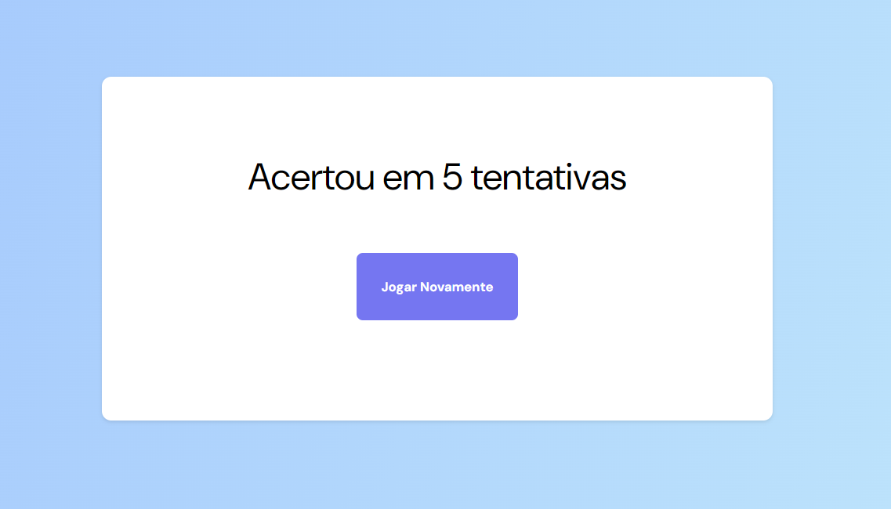

<h1 align="center"> Jogo da Advinhação </h1>

Um site para que eu possa mostrar um pequeno projeto para você brincar em adivinhar qual número vai vim.

  <a href="#-tecnologias">Tecnologias</a>&nbsp;&nbsp;&nbsp;|&nbsp;&nbsp;&nbsp;
  <a href="#-projeto">Projeto</a>&nbsp;&nbsp;&nbsp;

 

  
  

## 🚀 Tecnologias

Esse projeto foi desenvolvido com as seguintes tecnologias:

- HTML e CSS
- JavaScript
- Git e Github

## 💻 Projeto

- [Acesse o projeto finalizado, online](https://walderwilliam.github.io/Jogo_da_advinhação/)
